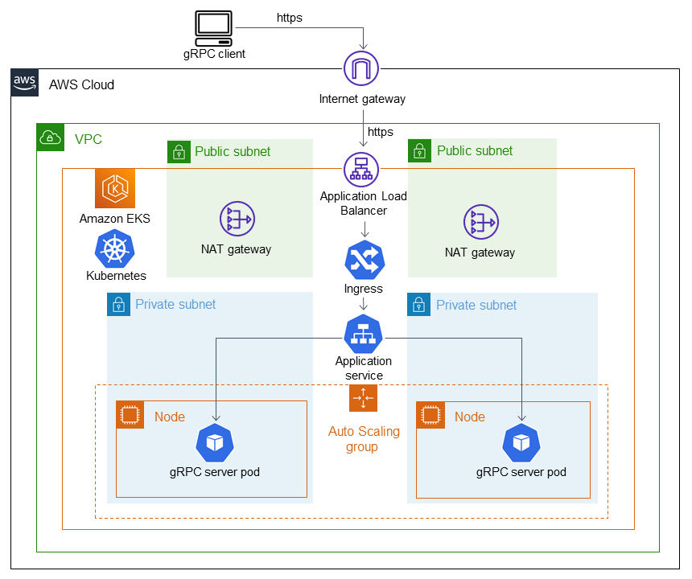
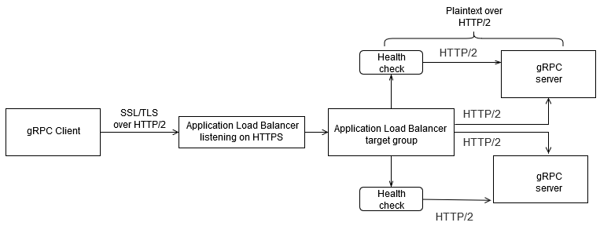

# aws-grpc-chat

Acronym &mdash; Title: gRPC

Authors: Tomasz Bochnak, Mateusz Kleszcz, Maciej Nessel, Tomasz Ostafin

Year, Group: 4, 4

## Introduction
Live video streaming services are becoming more and more popular. Most of them are accompanied with a chat which allows the audience to share comments among each other and with the streamer. Some of these live streams achieve a high number of viewers, with millions commenting live at the same time. This requires modern infrastructure and legacy solutions like HTTP polling or WebSockets may not work as desired in a high load environment like this one. On the other hand, gRPC solves the issues other technologies are facing by supporting load balancing and providing server streaming.

## Theoretical background/technology stack
The example streaming app with the chat is going to be deployed on AWS. The architecture will look something like this:

Additionally to gRPC, the following technologies will be used:
- Docker
- Kubernetes
- Helm

## Case study concept description
Clients will enter a web page on which a chat is present. They will automatically connect to it and will be able to see live comments in real time as well as write them to the chat. Each client may connect to a different server as the traffic will be load balanced behind the scenes.

## Solution architecture




[Source](https://docs.aws.amazon.com/prescriptive-guidance/latest/patterns/deploy-a-grpc-based-application-on-an-amazon-eks-cluster-and-access-it-with-an-application-load-balancer.html#deploy-a-grpc-based-application-on-an-amazon-eks-cluster-and-access-it-with-an-application-load-balancer-architecture)

## Environment configuration description
The architecture will be deployed using the CloudFormation templates. All you need is an AWS account.

## Installation method
Besides the technologies mentioned earlier, uou need to install the AWS CLI package and run `aws configure` in your terminal to set it up.

## How to reporduce - step by step
### Infrastructure as Code approach
AWS Cloudformation templates are used to deploy this application. They can be found in the `aws` directory.

## Demo deployment steps
### Configuration set-up
1. Build and push the Docker images to Amazon ECR (replace <AWS_ACCOUNT_ID> with your AWS account ID):
* First, authenticate Docker with the Amazon ECR registry:
    ```
    aws ecr get-login-password --region us-east-1 --no-cli-auto-prompt | docker login --username AWS --password-stdin <AWS_ACCOUNT_ID>.dkr.ecr.us-east-1.amazonaws.com
    ```
* GRPC server:
    ```
    aws ecr create-repository --repository-name aws-grpc-server
    ```
    ```
    cp -R app/proto app/server && docker build -t <AWS_ACCOUNT_ID>.dkr.ecr.us-east-1.amazonaws.com/aws-grpc-server:1.0 app/server && rm -R app/server/proto/
    ```
    ```
    docker push <AWS_ACCOUNT_ID>.dkr.ecr.us-east-1.amazonaws.com/aws-grpc-server:1.0
    ```

* GRPC client:
    ```
    aws ecr create-repository --repository-name aws-grpc-client
    ```
    ```
    docker build -t <AWS_ACCOUNT_ID>.dkr.ecr.us-east-1.amazonaws.com/aws-grpc-client:1.0 app/frontend
    ```
    ```
    aws ecr get-login-password --region us-east-1 --no-cli-auto-prompt | docker login --username AWS --password-stdin <AWS_ACCOUNT_ID>.dkr.ecr.us-east-1.amazonaws.com
    ```
    ```
    docker push <AWS_ACCOUNT_ID>.dkr.ecr.us-east-1.amazonaws.com/aws-grpc-client:1.0
    ```

2. Deploy the [domain CloudFormation stack](./aws/domain-cfn-template.yaml):
    1. Update the `DomainName` parameter with the desired domain name.
    2. Run the following to start the deployment:
        ```
        aws cloudformation deploy --template-file ./aws/domain-cfn-template.yaml \
        --stack-name suu-domain \
        --capabilities CAPABILITY_NAMED_IAM \
        --region us-east-1 \
        --profile default
        ```
    3. **During** the deployment add a CNAME record to your domain DNS configuration

3. Deploy the [infra CloudFormation stack](./aws/infra-cfn-template.yaml) (network, EKS cluster and node group):
    ```
    aws cloudformation deploy --template-file ./aws/infra-cfn-template.yaml \
    --stack-name suu-infra \
    --capabilities CAPABILITY_NAMED_IAM \
    --region us-east-1 \
    --profile default
    ```

4. Update the kubeconfig:
    ```
    aws eks update-kubeconfig --region us-east-1 --name suu-eks-cluster
    ```

5. Install the AWS Load Balancer Controller:
    ```
    helm repo add eks https://aws.github.io/eks-charts
    ```
    ```
    helm repo update eks
    ```
    ```
    helm install aws-load-balancer-controller eks/aws-load-balancer-controller \
    -n kube-system \
    --set clusterName=suu-eks-cluster \
    --set serviceAccount.create=true \
    --set serviceAccount.name=aws-load-balancer-controller 
    ```

6. Update the [manifest file](./aws/kubernetes/grpc.yaml) with the correct ECR image URL and domain name. Then apply it:
    ```
    kubectl apply -f ./aws/kubernetes/grpc.yaml
    ```

7. Update the /etc/hosts file by appending the IP address of the Application Load Balancer.

### Data preparation
Mock files with sample comments will be used to simulate huge traffic loads. Additionally, real clients will be able to write to the chat and their messages will be displayed in real time to others.

### Execution procedure
Run the Postman to connect to the server and receive responses
<!-- Run the [client](./app/helloworld_client_ssl.py) to connect to the server and receive responses. -->

### Results presentation

## Summary &mdash; conclusions

## References
[Deploy a gRPC-based application on an Amazon EKS cluster and access it with an Application Load Balancer](https://docs.aws.amazon.com/prescriptive-guidance/latest/patterns/deploy-a-grpc-based-application-on-an-amazon-eks-cluster-and-access-it-with-an-application-load-balancer.html)
