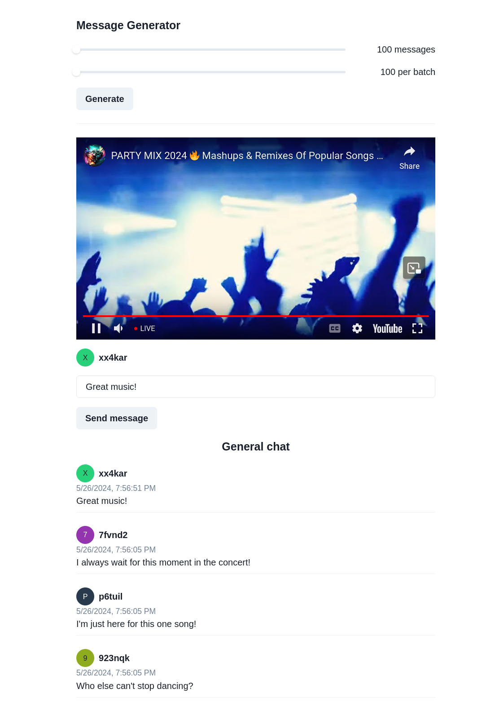

# aws-grpc-chat

Acronym &mdash; Title: gRPC

Authors: Tomasz Bochnak, Mateusz Kleszcz, Maciej Nessel, Tomasz Ostafin

Year, Group: 4, 4

## Introduction
Live video streaming services are becoming more and more popular. Most of them are accompanied with a chat, which allows the audience to share comments among each other and with the streamer. Some of these live streams achieve a high number of viewers, with millions commenting live at the same time. This requires modern infrastructure and legacy solutions like HTTP polling or WebSockets may not work as desired in a high load environment like this one. On the other hand, gRPC solves the issues other technologies are facing by supporting load balancing and providing server streaming.

## Theoretical background/technology stack
The example streaming app with the chat is deployed on AWS.

Additionally to gRPC, the following technologies will be used:
- Docker
- Kubernetes
- Helm

## Case study concept description
Clients enter a web page on which a chat is present. They automatically connect to it and can see live comments in real time as well as write their own to the chat. Each client may connect to a different server as the traffic is load balanced behind the scenes.

## Solution architecture


[Source](https://docs.aws.amazon.com/prescriptive-guidance/latest/patterns/deploy-a-grpc-based-application-on-an-amazon-eks-cluster-and-access-it-with-an-application-load-balancer.html#deploy-a-grpc-based-application-on-an-amazon-eks-cluster-and-access-it-with-an-application-load-balancer-architecture)

## Environment configuration description
The architecture is deployed using the CloudFormation templates. All you need is an AWS account.

## Installation method
Besides the technologies mentioned earlier, you need to install the AWS CLI package and run `aws configure` in your terminal to set it up.

## How to reporduce - step by step
### Infrastructure as Code approach
AWS CloudFormation templates are used to deploy this application. They can be found in the `aws` directory.

## Demo deployment steps
### Configuration set-up
**Note**: If you're running this script on Linux or macOS, make sure to run it with `sudo` to avoid issues with Docker sockets. Remember that in this case you need to run `sudo aws configure` and your AWS credentials will probably be placed in a different directory than usual (e.g. `/root/.aws/`).

Run the following script to deploy services on AWS and follow the instructions in the terminal:
```
scripts/deploy.sh
```
If necessary, update the `/etc/hosts` file by appending the IP address of the Application Load Balancer.

To start the EKS cluster monitoring, run:
```
scripts/start-monitoring.sh
```
Use the following credentials to log in:
- Username: `admin`
- Password: `admin`

### Data preparation
Real clients can write to the chat and their messages will be displayed in real time to others. Additionally to simulate large loads of traffic and scale pods, sample messages can be sent at once with a single button.

### Execution procedure
Go to `mnessel.pl/app` in your browser to enter the web chat and start sending messages.

You can add a `?ytid=` query param concatenated with a YouTube video/live ID to display it with the chat as well.

### Results presentation



## Summary &mdash; conclusions
The project showed us how to use gRPC in a distributed enviornment like the AWS Cloud. This allowed us to use load balancing to scale pods horizontally.

## References
[Deploy a gRPC-based application on an Amazon EKS cluster and access it with an Application Load Balancer](https://docs.aws.amazon.com/prescriptive-guidance/latest/patterns/deploy-a-grpc-based-application-on-an-amazon-eks-cluster-and-access-it-with-an-application-load-balancer.html)
